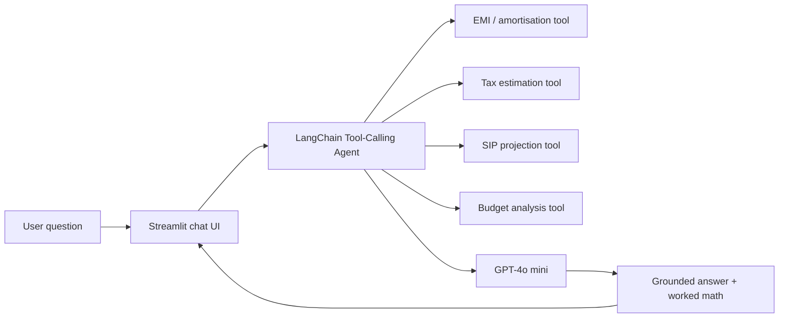

<!--
  FinHelper · README template — "Clean Pro" edition
  Replace into: ap1807/FinHelper/README.md
  Adjust file paths / commands in Quickstart to match your actual project layout.
-->

<h1 align="center">FinHelper</h1>

<p align="center">
  <strong>An AI-powered personal finance assistant that answers money questions with tools, not guesses.</strong>
</p>

<p align="center">
  
  
  
  
  <a href="LICENSE"></a>
</p>

---

## Overview

Most "AI finance chatbots" hallucinate numbers. **FinHelper** takes a different route:
a LangChain **tool-calling agent** computes every critical figure with deterministic
Python tools, and the LLM only orchestrates, explains, and advises. Ask it to compare
two loan offers and it will call the EMI tool, run the amortisation schedule, and give
you a defensible answer — with the working shown.

Built for the Indian retail-finance context: rupee amounts, Indian tax slabs, SIP and
EMI conventions that people actually use.

## What it can do

| Capability | How it works |
|---|---|
| **Loan EMI engine** | Exact EMI, total interest, and amortisation schedules for any principal / rate / tenure |
| **Tax estimation** | Estimates income-tax liability under Indian slabs before you commit to a decision |
| **SIP & goal planning** | Projects corpus growth for recurring investments against a target |
| **Budget analysis** | Breaks down stated income vs. expenses and flags leaks |
| **Grounded answers** | Every number is produced by a typed tool call — never by the LLM "guessing" |

## Architecture



## Quickstart

```bash
# 1. Clone and enter the project
git clone https://github.com/ap1807/FinHelper.git
cd FinHelper

# 2. Create a virtual environment
python -m venv .venv
source .venv/bin/activate        # Windows: .venv\Scripts\activate

# 3. Install dependencies
pip install -r requirements.txt

# 4. Add your OpenAI key
cp .env.example .env             # then edit .env → OPENAI_API_KEY=sk-...

# 5. Run
streamlit run app.py
```

> **Note** — if your entry file is named differently (e.g. `main.py` or `src/app.py`),
> point `streamlit run` at that file instead.

## Project structure

```text
FinHelper/
├── app.py                  # Streamlit entrypoint
├── agent/                  # LangChain agent + prompt templates
├── tools/                  # EMI, tax, SIP, budget tool implementations
├── requirements.txt
├── .env.example            # OPENAI_API_KEY placeholder
└── README.md
```

## Roadmap

- [ ] PDF statement ingestion → automatic expense categorisation
- [ ] Vector-memory for multi-session financial goals
- [ ] Local LLM fallback (Ollama) for key-free usage
- [ ] Deployed demo link

## Connect

Built by [Adityaraj Patil](https://github.com/ap1807) ·
[Portfolio](https://www.aiwithadi.in) ·
[LinkedIn](https://www.linkedin.com/in/-adityaraj-patil18)

If this project helped you, consider starring the repo — it genuinely helps visibility.
